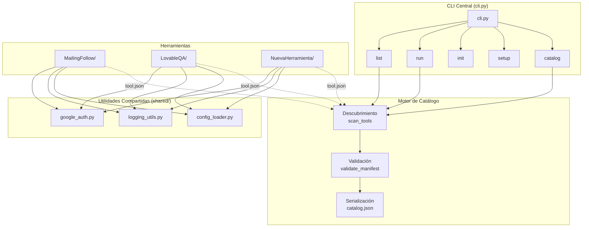
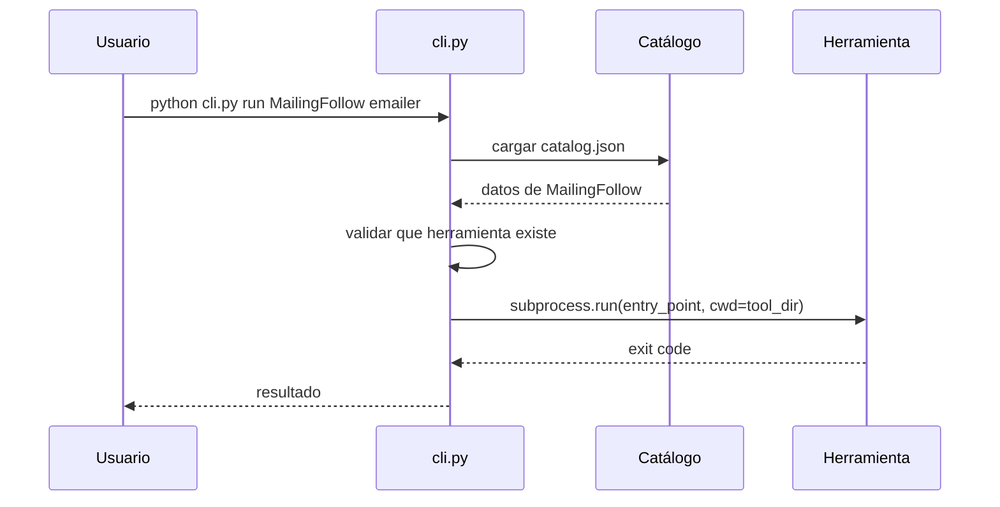

# Documento de Diseño — Repositorio de Herramientas

## Visión General

Este documento describe la arquitectura técnica para transformar el repositorio actual (que contiene `MailingFollow/` y `LovableQA/` como directorios independientes) en un monorepo estructurado con una CLI central, un sistema de manifiestos (`tool.json`), utilidades compartidas y un framework para agregar nuevas herramientas.

El diseño se centra en tres pilares:

1. **Descubrimiento automático**: Cada herramienta se autodescribe mediante un manifiesto JSON (`tool.json`), permitiendo que la CLI central las catalogue y ejecute sin configuración manual.
2. **Reutilización**: Un paquete Python compartido (`shared/`) centraliza autenticación Google, logging y carga de configuración, eliminando la duplicación existente entre MailingFollow y LovableQA.
3. **Extensibilidad**: El comando `init` genera la estructura base para nuevas herramientas, garantizando consistencia desde el primer commit.

### Decisiones de Diseño Clave

| Decisión | Elección | Justificación |
|---|---|---|
| Lenguaje de la CLI | Python 3.9+ | Consistente con las herramientas existentes |
| Framework CLI | `argparse` (stdlib) | Sin dependencias externas, suficiente para los comandos requeridos |
| Formato de manifiesto | JSON (`tool.json`) | Simple, validable, ya usado en el ecosistema (config.json) |
| Paquete compartido | `pip install -e shared/` | Permite imports limpios sin manipular `sys.path` |
| Versionado semántico | Regex `^\d+\.\d+\.\d+$` | Estándar de la industria, fácil de validar |

## Arquitectura

### Diagrama de Componentes



### Diagrama de Estructura de Directorios

```
repositorio/
├── cli.py                      # Entry point de la CLI central
├── catalog.json                # Catálogo generado automáticamente
├── README.md                   # Índice de herramientas
├── .gitignore                  # Patrones de exclusión globales
├── shared/                     # Paquete de utilidades compartidas
│   ├── setup.py                # Instalación como paquete editable
│   ├── shared_utils/
│   │   ├── __init__.py
│   │   ├── google_auth.py      # Autenticación OAuth2 Google
│   │   ├── logging_utils.py    # Logging estandarizado
│   │   └── config_loader.py    # Carga y validación de config
├── MailingFollow/
│   ├── tool.json               # Manifiesto
│   ├── README.md
│   ├── requirements.txt
│   ├── config.example.json
│   ├── emailer.py
│   ├── import_contacts.py
│   └── verify_emails.py
├── LovableQA/
│   ├── tool.json               # Manifiesto
│   ├── README.md
│   ├── requirements.txt
│   ├── config.example.json
│   ├── qa.py
│   ├── security_scanner.py
│   ├── scalability_scanner.py
│   └── report_generator.py
└── <nueva_herramienta>/        # Generada por `init`
    ├── tool.json
    ├── README.md
    ├── requirements.txt
    ├── config.example.json
    └── main.py
```

### Flujo de Ejecución Principal



## Componentes e Interfaces

### 1. Módulo de Manifiesto (`manifest.py`)

Responsable de parsear, validar y representar manifiestos `tool.json`.

```python
# Interfaz pública
def load_manifest(tool_dir: str) -> dict:
    """Carga y valida un tool.json desde un directorio.
    Raises: ManifestError si el archivo no existe o es inválido."""

def validate_manifest(data: dict) -> list[str]:
    """Retorna lista de errores de validación. Lista vacía = válido."""

def is_valid_semver(version: str) -> bool:
    """Verifica formato MAJOR.MINOR.PATCH."""

REQUIRED_FIELDS = ["name", "version", "description", "author", "language", "entry_point"]
```

### 2. Motor de Catálogo (`catalog.py`)

Escanea el repositorio, recolecta manifiestos válidos y genera `catalog.json`.

```python
def scan_tools(repo_root: str) -> list[dict]:
    """Escanea directorios en la raíz buscando tool.json válidos.
    Retorna lista de manifiestos válidos.
    Emite warnings para directorios con manifiestos inválidos."""

def generate_catalog(repo_root: str) -> dict:
    """Genera el catálogo completo y lo escribe en catalog.json.
    Retorna el dict del catálogo."""

def load_catalog(repo_root: str) -> dict:
    """Carga catalog.json existente. Retorna dict vacío si no existe."""

def serialize_catalog(catalog: dict) -> str:
    """Serializa el catálogo a JSON string."""

def deserialize_catalog(json_str: str) -> dict:
    """Deserializa un JSON string a dict de catálogo."""
```

### 3. CLI Central (`cli.py`)

Punto de entrada único. Usa `argparse` con subcomandos.

```python
# Subcomandos
def cmd_list(args):
    """Muestra herramientas del catálogo: nombre, versión, descripción."""

def cmd_run(args):
    """Ejecuta entry_point de una herramienta con argumentos opcionales.
    args.tool_name: str, args.tool_args: list[str]"""

def cmd_init(args):
    """Crea estructura base para nueva herramienta.
    args.name: str"""

def cmd_setup(args):
    """Crea venv e instala dependencias para una herramienta.
    args.tool_name: str"""

def cmd_catalog(args):
    """Regenera catalog.json escaneando todos los manifiestos."""
```

### 4. Utilidades Compartidas (`shared/shared_utils/`)

#### google_auth.py
```python
def get_google_credentials(
    scopes: list[str],
    credentials_file: str = "credentials.json",
    token_file: str = "token.json"
) -> Credentials:
    """Gestiona flujo OAuth2 completo: carga token, refresca si expiró,
    o inicia flujo interactivo. Almacena token actualizado."""
```

#### logging_utils.py
```python
def get_logger(tool_name: str, level: str = "INFO") -> logging.Logger:
    """Retorna logger configurado con formato:
    [YYYY-MM-DD HH:MM:SS] [LEVEL] [tool_name] mensaje"""
```

#### config_loader.py
```python
def load_config(
    config_path: str,
    required_fields: list[str] | None = None
) -> dict:
    """Carga JSON y valida campos obligatorios.
    Raises: FileNotFoundError, ConfigValidationError."""
```


### 5. Módulo de Scaffolding (`scaffold.py`)

Genera la estructura de archivos para nuevas herramientas.

```python
def create_tool_scaffold(repo_root: str, tool_name: str) -> str:
    """Crea directorio con tool.json, README.md, requirements.txt,
    main.py y config.example.json.
    Raises: FileExistsError si el directorio ya existe.
    Retorna la ruta del directorio creado."""

def generate_template_manifest(tool_name: str) -> dict:
    """Genera manifiesto plantilla con versión 0.1.0."""

def generate_template_readme(tool_name: str) -> str:
    """Genera README con secciones: Descripción, Requisitos,
    Configuración, Uso, Estructura de archivos."""
```

### 6. Módulo de Setup (`setup_tool.py`)

Gestiona entornos virtuales y dependencias por herramienta.

```python
def setup_tool(repo_root: str, tool_name: str) -> bool:
    """Crea venv en tool_dir/venv e instala requirements.txt.
    Retorna True si exitoso, False si hubo error en pip.
    Emite warning si requirements.txt no existe o está vacío."""
```

## Modelos de Datos

### Manifiesto (`tool.json`)

```json
{
  "name": "MailingFollow",
  "version": "1.0.0",
  "description": "Automatización de cold emails personalizados con seguimiento vía Gmail y Google Sheets",
  "author": "Equipo Certfika",
  "language": "python",
  "entry_point": "python emailer.py",
  "dependencies": ["anthropic", "gspread", "google-auth"],
  "commands": {
    "emailer": "python emailer.py",
    "import": "python import_contacts.py",
    "verify": "python verify_emails.py"
  }
}
```

**Esquema de validación:**

| Campo | Tipo | Obligatorio | Validación |
|---|---|---|---|
| `name` | string | Sí | No vacío |
| `version` | string | Sí | Formato semver `^\d+\.\d+\.\d+$` |
| `description` | string | Sí | No vacío |
| `author` | string | Sí | No vacío |
| `language` | string | Sí | No vacío |
| `entry_point` | string | Sí | No vacío |
| `dependencies` | list[string] | No | Lista de strings |
| `commands` | dict[str, str] | No | Claves y valores no vacíos |

### Catálogo (`catalog.json`)

```json
{
  "generated_at": "2025-01-15T10:30:00",
  "tools": [
    {
      "name": "MailingFollow",
      "version": "1.0.0",
      "description": "Automatización de cold emails...",
      "language": "python",
      "directory": "MailingFollow",
      "commands": {
        "emailer": "python emailer.py",
        "import": "python import_contacts.py",
        "verify": "python verify_emails.py"
      }
    },
    {
      "name": "LovableQA",
      "version": "1.0.0",
      "description": "QA automatizado para proyectos Lovable...",
      "language": "python",
      "directory": "LovableQA",
      "commands": {
        "qa": "python qa.py"
      }
    }
  ]
}
```

### Manifiesto Plantilla (generado por `init`)

```json
{
  "name": "<nombre_herramienta>",
  "version": "0.1.0",
  "description": "",
  "author": "",
  "language": "python",
  "entry_point": "python main.py",
  "dependencies": [],
  "commands": {}
}
```

### Configuración de Herramienta (`config.json` / `config.example.json`)

Cada herramienta define su propio esquema. El `config_loader` valida campos obligatorios definidos por la herramienta en tiempo de ejecución.

```json
// config.example.json (MailingFollow)
{
  "spreadsheet_id": "<ID_DE_TU_GOOGLE_SHEET>",
  "from_email": "<tu_email@dominio.com>",
  "firma": "<Tu Nombre - Tu Cargo>",
  "anthropic_api_key": "<sk-ant-xxxxx>",
  "delay_between_emails": 30,
  "follow_up_days": [3, 4, 6]
}
```


## Propiedades de Correctitud

*Una propiedad es una característica o comportamiento que debe mantenerse verdadero en todas las ejecuciones válidas de un sistema — esencialmente, una declaración formal sobre lo que el sistema debe hacer. Las propiedades sirven como puente entre especificaciones legibles por humanos y garantías de correctitud verificables por máquinas.*

### Propiedad 1: Validación de manifiesto rechaza campos faltantes

*Para cualquier* diccionario que represente un manifiesto, si le falta al menos uno de los campos obligatorios (`name`, `version`, `description`, `author`, `language`, `entry_point`), entonces `validate_manifest` debe retornar una lista no vacía de errores que incluya el nombre del campo faltante.

**Valida: Requisitos 1.4, 2.2**

### Propiedad 2: Validación semver clasifica correctamente

*Para cualquier* string, `is_valid_semver` debe retornar `True` si y solo si el string coincide con el patrón `MAJOR.MINOR.PATCH` donde cada componente es un entero no negativo. Strings que no sigan este formato deben retornar `False`.

**Valida: Requisito 2.5**

### Propiedad 3: El catálogo contiene exactamente las herramientas con manifiestos válidos

*Para cualquier* conjunto de directorios donde algunos contienen manifiestos válidos y otros no, `scan_tools` debe retornar exactamente los manifiestos válidos, excluyendo los inválidos.

**Valida: Requisitos 3.1, 3.3**

### Propiedad 4: Las entradas del catálogo contienen todos los campos requeridos

*Para cualquier* manifiesto válido incluido en el catálogo, la entrada correspondiente debe contener los campos: nombre, versión, descripción, lenguaje y comandos disponibles.

**Valida: Requisito 3.2**

### Propiedad 5: Round-trip de serialización del catálogo

*Para cualquier* catálogo válido, serializar a JSON y luego deserializar debe producir un resultado equivalente al original.

**Valida: Requisito 3.6**

### Propiedad 6: Run con herramienta inexistente produce error con lista de disponibles

*Para cualquier* catálogo y cualquier nombre de herramienta que no exista en el catálogo, el comando `run` debe producir un mensaje de error que contenga el nombre buscado y los nombres de las herramientas disponibles.

**Valida: Requisito 4.3**

### Propiedad 7: Init crea la estructura completa de scaffold

*Para cualquier* nombre de herramienta válido (que no exista como directorio), el comando `init` debe crear un directorio que contenga exactamente: `tool.json`, `README.md`, `requirements.txt`, `main.py` y `config.example.json`.

**Valida: Requisitos 4.4, 7.1, 9.3**

### Propiedad 8: Init genera manifiesto plantilla correcto

*Para cualquier* nombre de herramienta, el manifiesto generado por `init` debe tener `name` igual al nombre proporcionado, `version` igual a `"0.1.0"`, `description` y `author` como strings vacíos, y `entry_point` igual a `"python main.py"`.

**Valida: Requisito 7.2**

### Propiedad 9: Init genera README con todas las secciones requeridas

*Para cualquier* nombre de herramienta, el README generado por `init` debe contener las secciones: Descripción, Requisitos, Configuración, Uso y Estructura de archivos.

**Valida: Requisito 7.3**

### Propiedad 10: El formato de log incluye todos los componentes

*Para cualquier* nombre de herramienta, nivel de severidad y mensaje, la salida formateada del logger debe contener un timestamp válido, el nivel de severidad y el nombre de la herramienta.

**Valida: Requisito 5.2**

### Propiedad 11: El cargador de configuración detecta campos obligatorios faltantes

*Para cualquier* diccionario JSON y cualquier conjunto de campos obligatorios, si al diccionario le falta al menos un campo obligatorio, `load_config` debe lanzar una excepción que indique qué campos faltan.

**Valida: Requisito 5.3**

## Manejo de Errores

| Escenario | Componente | Comportamiento |
|---|---|---|
| `tool.json` no existe en directorio | `manifest.py` | `ManifestError` con ruta del directorio |
| `tool.json` no es JSON válido | `manifest.py` | `ManifestError` indicando error de parseo |
| Campo obligatorio faltante en manifiesto | `manifest.py` | Lista de errores con nombres de campos faltantes |
| Versión no es semver válido | `manifest.py` | Error de validación con formato esperado |
| `run` con herramienta inexistente | `cli.py` | Mensaje de error + lista de herramientas disponibles |
| `init` con directorio existente | `cli.py` | `FileExistsError` con nombre del directorio |
| `init` sin nombre | `cli.py` / `argparse` | Mensaje de uso con formato correcto |
| `setup` con `requirements.txt` vacío/inexistente | `setup_tool.py` | Warning + crea venv sin instalar deps |
| `setup` falla en `pip install` | `setup_tool.py` | Muestra stderr completo de pip, mantiene venv |
| `config.json` no encontrado | `config_loader.py` | `FileNotFoundError` descriptivo |
| Campo obligatorio faltante en config | `config_loader.py` | `ConfigValidationError` con campos faltantes |
| Import de módulo compartido inexistente | `shared_utils/__init__.py` | `ImportError` con lista de módulos disponibles |
| `catalog.json` no existe al ejecutar `list` | `catalog.py` | Mensaje indicando ejecutar `catalog` primero |

### Excepciones Personalizadas

```python
class ManifestError(Exception):
    """Error al cargar o validar un manifiesto tool.json."""
    pass

class ConfigValidationError(Exception):
    """Error de validación en archivo de configuración."""
    def __init__(self, missing_fields: list[str]):
        self.missing_fields = missing_fields
        super().__init__(f"Campos obligatorios faltantes: {', '.join(missing_fields)}")
```

## Estrategia de Testing

### Enfoque Dual

Se utilizarán dos tipos de tests complementarios:

- **Tests unitarios**: Para ejemplos específicos, edge cases y condiciones de error concretas.
- **Tests de propiedades (PBT)**: Para verificar propiedades universales con inputs generados aleatoriamente.

### Librería de Property-Based Testing

Se usará **Hypothesis** (`hypothesis` para Python), la librería estándar de PBT para Python.

### Configuración de Tests de Propiedades

- Mínimo **100 iteraciones** por test de propiedad (`@settings(max_examples=100)`)
- Cada test debe referenciar su propiedad del documento de diseño con un comentario:
  ```python
  # Feature: tools-repository, Property 1: Validación de manifiesto rechaza campos faltantes
  ```
- Formato de tag: **Feature: tools-repository, Property {número}: {texto de la propiedad}**
- Cada propiedad de correctitud debe ser implementada por **un único test de propiedad**

### Tests de Propiedades (PBT)

| Propiedad | Generador | Verificación |
|---|---|---|
| P1: Validación manifiesto | Dicts con subconjuntos aleatorios de campos obligatorios | Errores incluyen campos faltantes |
| P2: Validación semver | Strings aleatorios + strings semver válidos generados | `is_valid_semver` clasifica correctamente |
| P3: Catálogo = manifiestos válidos | Listas de dicts (válidos e inválidos) en dirs temporales | Catálogo contiene exactamente los válidos |
| P4: Campos en entradas del catálogo | Manifiestos válidos aleatorios | Cada entrada tiene name, version, description, language, commands |
| P5: Round-trip catálogo | Catálogos aleatorios con listas de herramientas | `deserialize(serialize(cat)) == cat` |
| P6: Run con tool inexistente | Catálogos + nombres no presentes | Error contiene nombre buscado y disponibles |
| P7: Init crea scaffold completo | Nombres de herramienta aleatorios (alfanuméricos) | Directorio contiene los 5 archivos esperados |
| P8: Init manifiesto plantilla | Nombres de herramienta aleatorios | Campos del manifiesto coinciden con plantilla |
| P9: Init README secciones | Nombres de herramienta aleatorios | README contiene las 5 secciones |
| P10: Formato de log | (tool_name, level, message) aleatorios | Output contiene timestamp, level, tool_name |
| P11: Config valida campos | Dicts + listas de campos obligatorios | Excepción con campos faltantes correctos |

### Tests Unitarios (Ejemplos y Edge Cases)

| Test | Tipo | Descripción |
|---|---|---|
| README raíz lista herramientas | Ejemplo (1.2) | Verificar que README.md contiene MailingFollow y LovableQA |
| MailingFollow tiene manifiesto válido | Ejemplo (6.1) | Cargar `MailingFollow/tool.json` y validar |
| Run MailingFollow emailer | Ejemplo (6.3) | Verificar que resuelve a `emailer.py` en directorio correcto |
| .gitignore contiene patrones sensibles | Ejemplo (9.1) | Verificar patrones: credentials.json, token.json, .env, venv/ |
| config.example.json existe en MailingFollow | Ejemplo (6.5) | Verificar existencia y estructura JSON válida |
| Init con directorio existente falla | Edge case (4.5) | `init MailingFollow` debe lanzar error |
| Init sin nombre muestra uso | Edge case (7.4) | Verificar mensaje de uso |
| Setup con requirements.txt vacío | Edge case (8.3) | Crea venv, emite warning, no instala deps |
| Setup falla en pip | Edge case (8.4) | Muestra error completo, mantiene venv |
| Manifiesto con dependencies no-lista | Edge case (2.3) | Validación rechaza `dependencies: "string"` |
| Manifiesto con commands no-dict | Edge case (2.4) | Validación rechaza `commands: ["list"]` |
| Import módulo compartido inexistente | Ejemplo (5.4) | `from shared_utils import nonexistent` lanza ImportError descriptivo |

### Estructura de Tests

```
tests/
├── test_manifest.py        # P1, P2 + edge cases de validación
├── test_catalog.py         # P3, P4, P5 + edge cases
├── test_cli.py             # P6, P7, P8, P9 + edge cases de comandos
├── test_shared_utils.py    # P10, P11 + edge cases de utilidades
└── test_integration.py     # Tests de ejemplo e integración (6.1, 6.3, 9.1)
```
